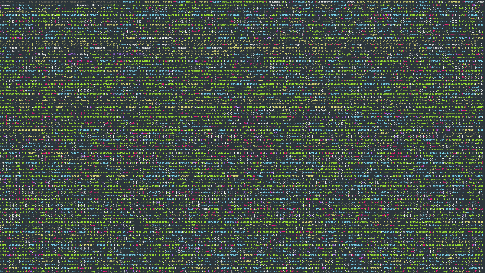

I have also added backgrounds I have made at the top of this and add attributions to where I got other backgrounds from.

## Designed By Me
These are backgrounds I have created myself either for a purpose or just for the interest of how it was created.

### Mass jQuery

I created this image to back my YouTube banner. I used JavaScript as it can be compressed unlike Python and I could easily get plenty of it, for example jQuery as I used in this.

This was made by making the code for jQuery fill the page and then use a pygments lexer to highlight the code.

A smaller version for smaller screens can be found [here](mass-jquery-small.png).

## Not Designed by Me
These are the backgrounds that are featured as my background in my YouTube videos.

### Hills Material Design Wallpaper

This is currently my favourite as it is so clean and has a very happy feel to it. Icons site nicely on it and it is very clear being 1920x1080. I found this in a Google Image search but [this is the origin](http://www.baltana.com/abstract/material-design-hd-desktop-wallpaper-23164.html)

### Material Design Blue

You will find I like material design and I used to try and design a lot of my projects to the specifications, this is obviously quite time-consuming so I settle for backgrounds, colours and icons.

This was also found by Google Image search but [originated here](http://wallpaperswide.com/material_design-wallpapers.html)

### Fluorescent Face

I really liked the colours in this background. Monitors that render colour well makes this image look amazing. Unfortunately, I don't remember where this image came from and a reverse image search is not providing hints by giving me 30 different results at the same resolution.

### LHC Blocks

This image is a representation of some data collected by the LHC. I loved the idea and all the colours of this and the black backing was a bonus. This image was actually an icon for the video ["Heavy Ion collision event display"](https://www.youtube.com/watch?v=fzNSME3h9rs) on YouTube.
