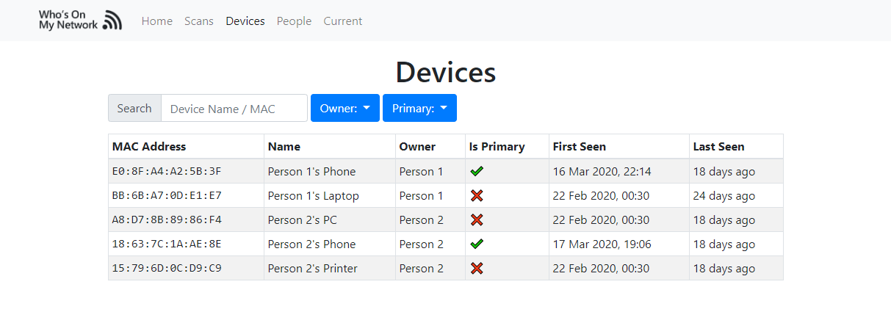

    
    
Keep an eye on who is on your network and when.

    <a href="https://github.com/brentvollebregt/whos-on-my-network/releases">
        <button class="btn btn-outline-secondary" type="button">Download the latest release →</button>
    </a>

Who's On My Network is a tool built-in Python with a React interface that allows you to scan your network to observe who's on it currently and look at past scans to see who was on it previously.

_This screenshot shows an overview of scans done between two dates and which devices were detected._

## What This Tool Does

This application does two primary tasks; scanning a network and displaying data.

The Python module is capable of scanning once or scanning repetitively. This is done by executing a basic command in a terminal.

All scans can then be identified in the interface where a user can create profiles for each person they know is on the network and assign discovered devices to people. This helps identify devices you do not know about and unusual connections.

## Getting the Tool Yourself

On every official version change, a [GitHub release](https://github.com/brentvollebregt/whos-on-my-network/releases) is made which contains two files:

- `whos_on_my_network.zip`: The whos_on_my_network module with the web app pre-built.
- `whos_on_my_network_binary.zip`: A Windows executable of whos_on_my_network (does not support plugins)

> The pre-built Windows executable does not use a plugin and will default to the built-in method. To make a build containing a particular plugin yourself, execute `bash package.sh {plugin-name}`; this will produce whos_on_my_network.exe which will use the declared plugin.

## Using The Tool

The tool is built around a Python module that can be run using `python -m whos_on_my_network <arguments>` or simply executing `python run.py <arguments>`.

If you are using the pre-build binary found in whos_on_my_network.zip, execute `whos_on_my_network.exe <arguments>` in a terminal.

> See [README.md in the git repository](https://github.com/brentvollebregt/whos-on-my-network#%EF%B8%8F-usage) for details about arguments.

### Scanning Your Network

To scan the network once, you can use `python -m whos_on_my_network current`. This will output a table displaying the MAC address, IP address and hostname of all detected devices. This data has also been saved to the database to be viewed later.

To scan the network repetitively, you can use `python -m whos_on_my_network watch`. This will scan the network every 5 minutes (by default - can be changed) repeatedly unless told to only scan a specific amount of times. Each scan will also be saved to the database to be viewed later.

### Viewing Scans and Creating Associations

Execute `python -m whos_on_my_network start` and go to `localhost:8080` in your browser. You can now view scans and create associations between devices and people.

> Note: Text substitution has been done in these screenshots below so connections may not add up; this is not the tool.

#### Scans

The scans page shows scans that have been made.

On the scans page, you can select a date range and view all the scans in that period. When clicking on a scan (row on the table), you will be directed to more focused data on that scan, in particular, showing the time, network id used and details about each device.

### Devices

The devices page shows all devices that have been detected from scans.

On the devices page, you can filter by a text search, a particular owner or primary status. When clicking on a device (row on the table), you will be directed to more focused data on that device in particular.

> A primary device is a user-defined field that can signify whether the device is always on the person or not - so it could be used to identify when near or not.

### People

The people page shows people that have been created by the user of this tool

On the people page, you can filter by a text search to find a particular person. When clicking on a person (row on the table), you will be directed to more focused data on that person in particular.

### Current

Another page is also supplied that allows you to run a single scan from the browser without having to run the scan command.

## How This Tool Works

By default, this tool uses [scapy](https://scapy.net/) to send ARP packets to all addresses in the provided network range (default is 192.168.1.0/24) to identify what devices are on the network. When a host responds, its MAC address, IP address and hostname are obtained and an entry is added to the SQLite database matched to the current scan.

Plugins are supported by this application to allow custom methods of scanning a network. An example has been provided for WiFi networks that use a [ASUS RT-AC58 router](https://github.com/brentvollebregt/whos-on-my-network/blob/master/whos_on_my_network/plugins/asus-rt-ac58u.py). This plugin demonstrates how you can instead look at the active devices connected to your router rather than scanning the network.

All data collected by the application is stored locally in an SQLite database.

## What Happened to the Original Version?

The original version is preserved in the git history under the [tag v1.0.0](https://github.com/brentvollebregt/whos-on-my-network/tree/v1.0.0).
